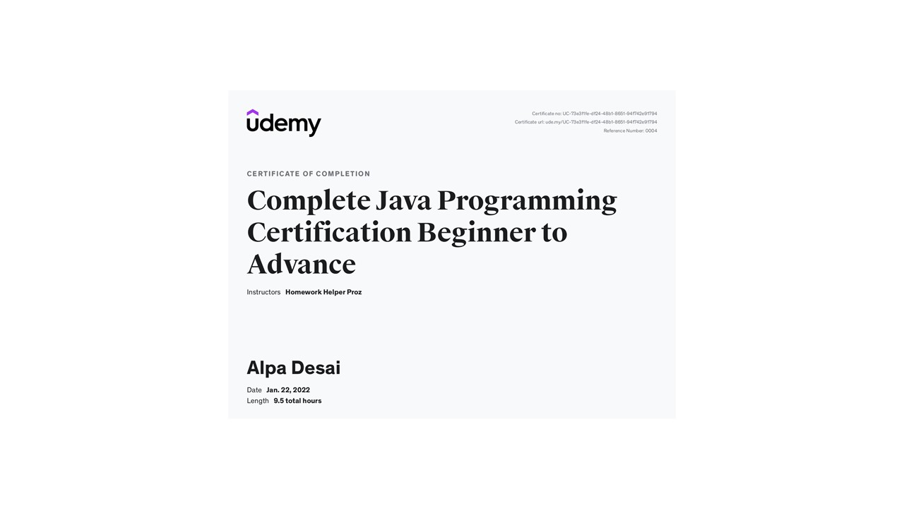

# Java Object Oriented Programming

The project provides an overview object oriented programming in Java

## Java Certification

## Java Certification 

## Modern Java

## Design Patterns Certification

Advanced knowledge reference : https://github.com/alpaddesai/SoftwareEngineering
